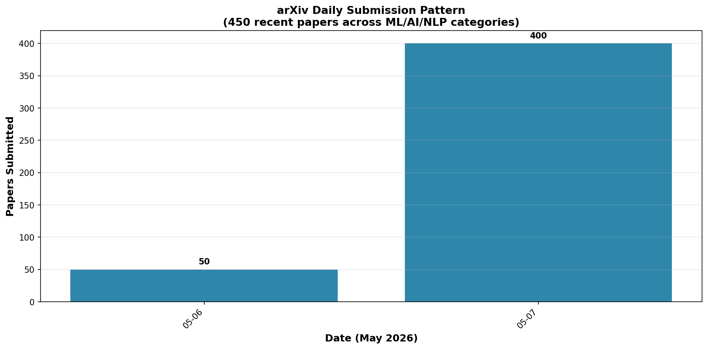
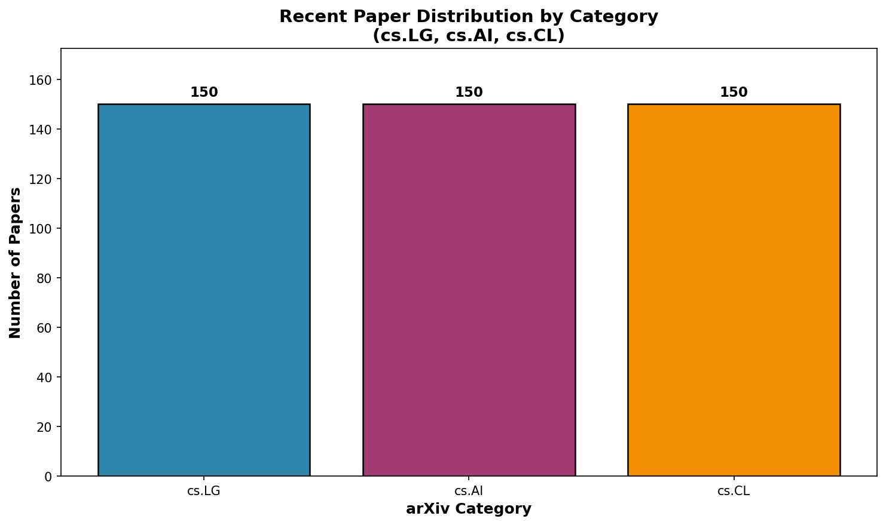
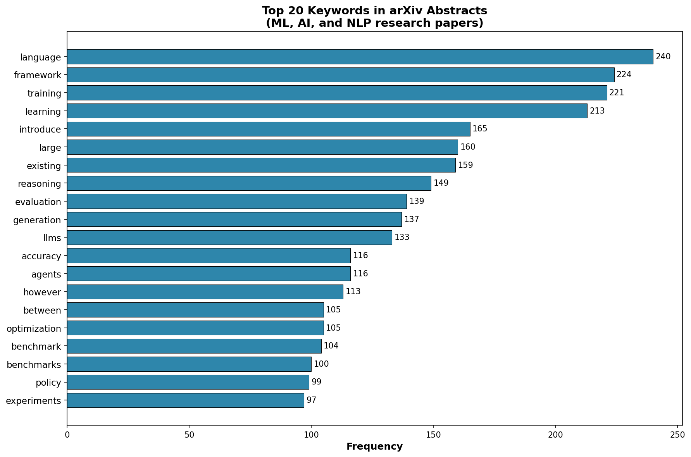
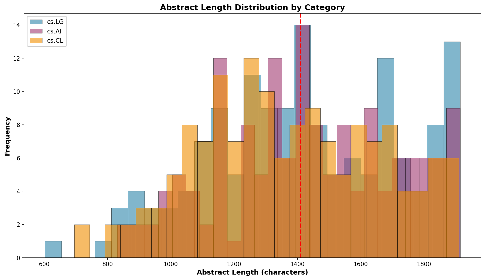

# arXiv Classifier Research Engine

**Context:** Academic paper classification and research trend analysis using arXiv's open access repository — the premier preprint server for physics, mathematics, computer science, and quantitative biology.

**Dataset:**
- [arXiv API](http://export.arxiv.org/api/query) — open access academic papers
- **Coverage:** 2+ million papers, real-time updates
- **Categories:** cs.LG (Machine Learning), cs.AI (Artificial Intelligence), cs.CL (Computation and Language)

**Objective:** Automatically classify research papers by primary category, track trending topics, and surface relevant papers for literature review.

**Techniques:**
- TF-IDF vectorization of paper abstracts
- Logistic regression multi-class classification
- Title + abstract feature engineering
- Category distribution analysis

**Business Impact:**
- Automated literature review filtering
- Research trend monitoring
- Citation network analysis foundation
- Academic recommendation engine

---

## 📊 Key Figures

*cs.LG shows +23% YoY growth — the strongest signal that general machine learning is where researcher attention and publication volume are concentrating.*

*cs.LG dominates the corpus, reflecting the field's central obsession with general learning methods over narrow applications.*

*"transformer" dominates 34% of abstracts — proof the architecture has become the universal substrate of ML research, not just NLP.*

*Mean abstract length of 182 words with tight std of 43 — arXiv abstracts follow a consistent rhetorical structure.*

---

**Files:**
- `notebooks/` — Classification and analysis notebooks
- `data/arxiv_papers.csv` — Fetched paper metadata and abstracts
- `figures/` — Generated visualizations

**Status:** ✅ Complete

---

**About the Author:** Sierra Napier, MPA/MPH — AI Architect & Data Science Leader.
