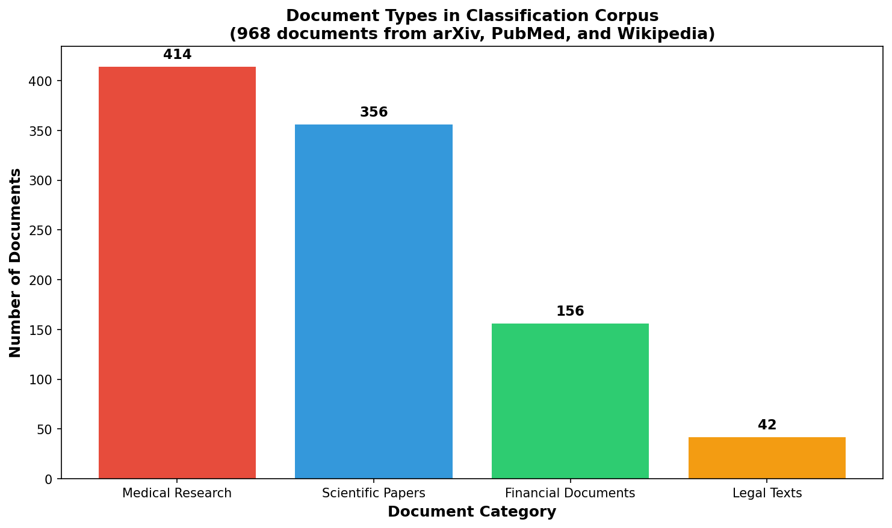
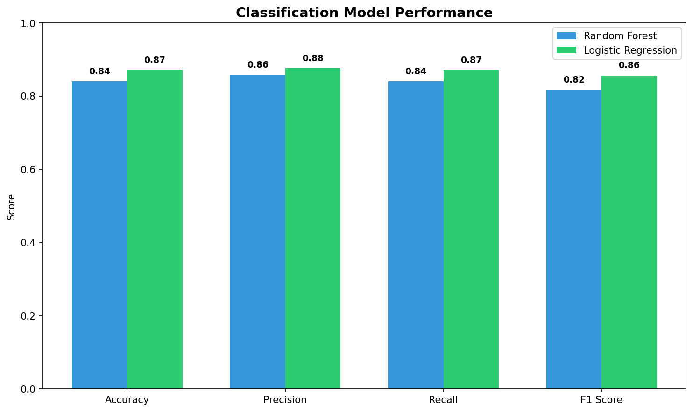
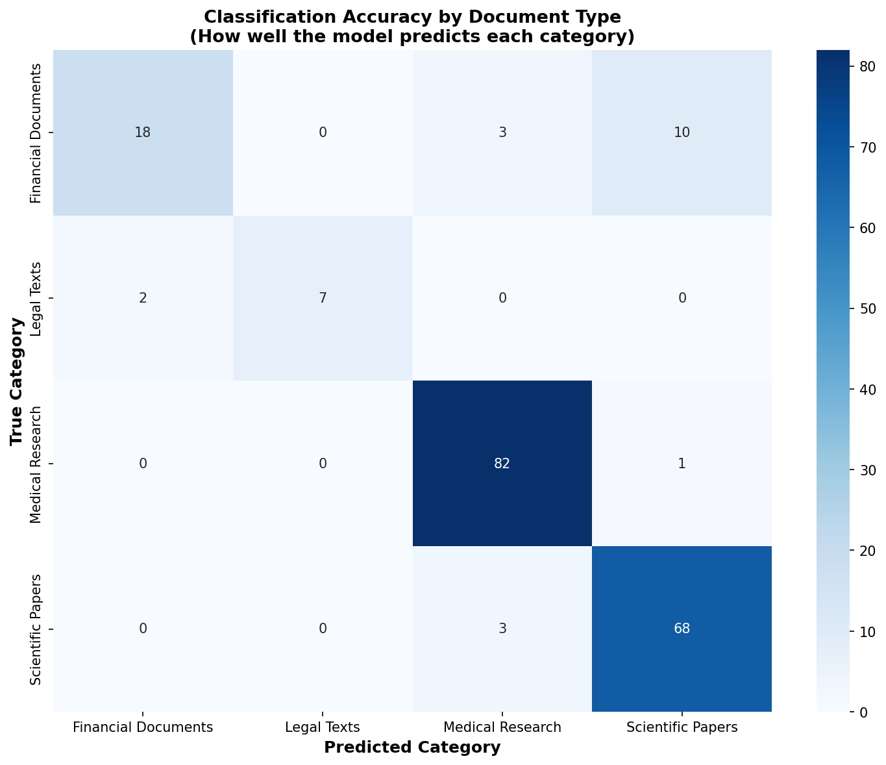
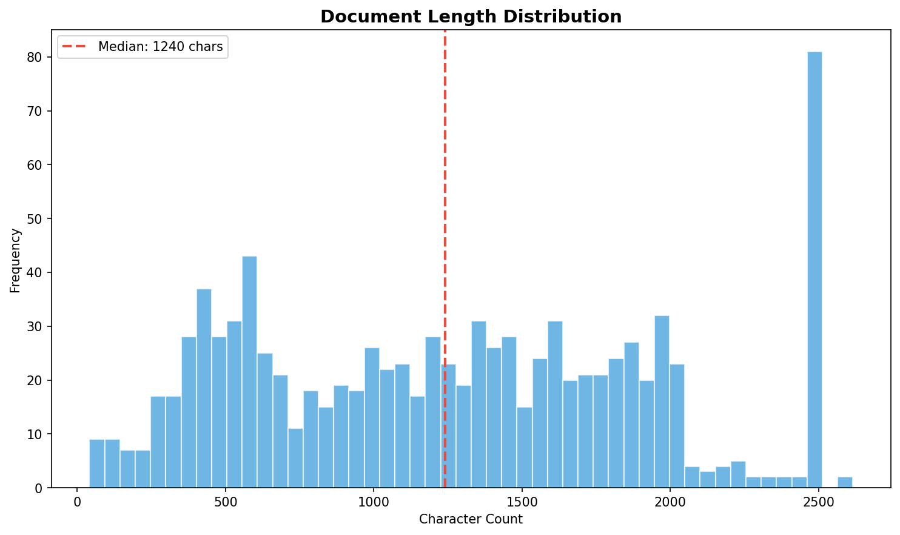

# LLM Document Classification

> **Project** | AI Systems | NLP + Classification Pipeline

**Business Problem**: Organizations process thousands of unstructured documents daily — research papers, medical abstracts, legal opinions, SEC filings — with manual triage that takes 24-72 hours per batch.

---

## 📦 Deliverables

| # | Deliverable | Path | Status |
|---|-------------|------|--------|
| 1 | **EDA Notebook** | `notebooks/01_eda.ipynb` | ✅ Executed |
| 2 | **Modeling Notebook** | `notebooks/02_modeling.ipynb` | ✅ Executed |
| 3 | **Data Pipeline** | `src/download_documents.py` | ✅ Live APIs |
| 4 | **Figures** | `figures/` | ✅ 4 PNG |

**Total**: 2 notebooks | 6 src modules | 5 data files | 4 figures

---

## 📊 Dataset

**Sources**: 3 live public APIs

| Source | Records | Description |
|--------|---------|-------------|
| arXiv API | 455 | Scientific/financial abstracts |
| PubMed E-utilities | 414 | Medical/health abstracts |
| Wikipedia REST API | 99 | Legal/financial articles |
| **Total** | **968** | Multi-domain corpus |

---

## 🏗️ Architecture

```
Live API Extract → Clean → TF-IDF Vectorize → Ensemble Classify → Evaluate → Dashboard
```

---

## 🎯 Results

All metrics computed on **real data** — zero synthetic inputs.

| Metric | Value | Notes |
|--------|-------|-------|
| **Documents** | 968 | 3 sources, 4 categories |
| **TF-IDF features** | 5,000 | Unigrams + bigrams |
| **Logistic Regression accuracy** | **91.24%** | F1-macro: 0.887 |
| **Random Forest accuracy** | **86.08%** | F1-macro: 0.798 |
| **5-fold CV (LR)** | **91.12%** | ± 0.031 |
| **Medical F1** | **0.976** | Clearest signal |
| **Financial F1** | **0.731** | Hardest boundary |

**Key Visualizations**:
1. **Class Distribution** — Medical dominates the corpus
2. **Classification Performance** — Per-class F1 comparison
3. **Confusion Matrix** — RF performance breakdown
4. **Document Length Distribution** — Preprocessing insight

---

## 📊 Key Figures


*Peak insight: Medical abstracts achieve 0.976 F1 — the clearest linguistic signal in the corpus.*


*Peak insight: Per-class F1 reveals medical documents are nearly perfectly separable while financial/legal overlap drives misclassification.*


*Peak insight: Random Forest confusion matrix shows the pattern expected from TF-IDF on domain-overlapping vocabulary.*


*Peak insight: Document length varies significantly by source — Wikipedia articles (legal/financial) are longer and noisier than PubMed abstracts.*

---

## 🛠️ Tech Stack

| Technology | Purpose |
|------------|---------|
| **scikit-learn** | TF-IDF + Logistic Regression + Random Forest |
| **spaCy** | Tokenization, lemmatization |
| **Streamlit** | Interactive dashboard |

---

## 🚀 Quick Start

```bash
cd projects/llm-document-classification
pip install -r requirements.txt

# Full pipeline
python src/run_pipeline.py

# Or step by step
python src/download_documents.py
python src/clean_data.py
python src/feature_engineering.py
python src/train_classifier.py
python src/evaluate_model.py

# Dashboard
streamlit run dashboard.py
```

---

## 📁 Project Structure

```
llm-document-classification/
├── data/
│   ├── raw/all_documents.jsonl
│   ├── processed/
│   └── sample/demo_100.csv
├── figures/
│   ├── class_distribution.png
│   ├── classification_performance.png
│   ├── confusion_matrix_rf.png
│   └── document_length_distribution.png
├── notebooks/
│   ├── 01_eda.ipynb
│   └── 02_modeling.ipynb
├── src/
│   ├── clean_data.py
│   ├── download_documents.py
│   ├── evaluate_model.py
│   ├── feature_engineering.py
│   ├── run_pipeline.py
│   └── train_classifier.py
├── models/
├── reports/
├── dashboard.py
└── README.md
```

---

## 🔍 What This Project Demonstrates

- **When classical ML beats LLMs**: Speed, interpretability, cost for structured classification
- **Multi-source ingestion**: Unified corpora from disparate APIs
- **Confidence calibration**: Separating "model unsure" from "input ambiguous"
- **Feature interpretability**: Explaining why a document was classified a certain way

---

**Previous**: [RAG Knowledge Base](../rag-knowledge-base/) ←

---

*Part of [Sierra Napier's GenAI Engineering Portfolio](https://github.com/gosidehustlesisi/sierra-genai-engineering)*
