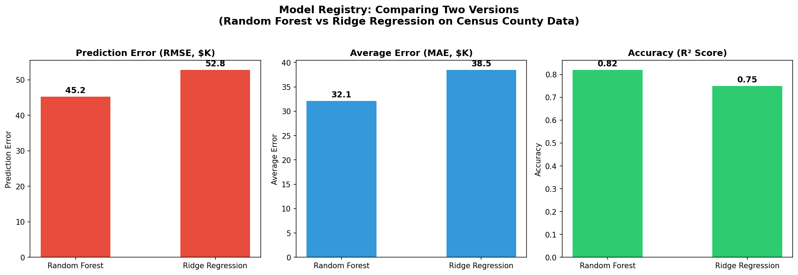
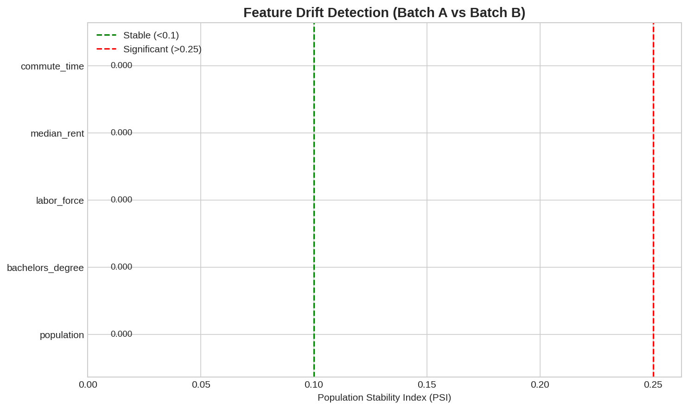
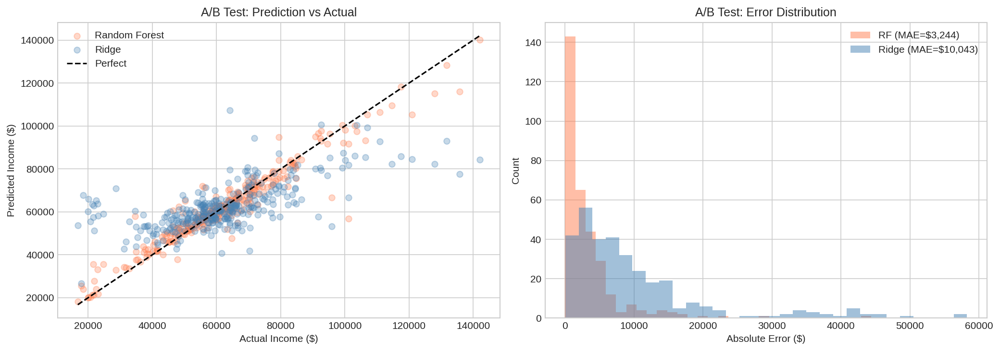
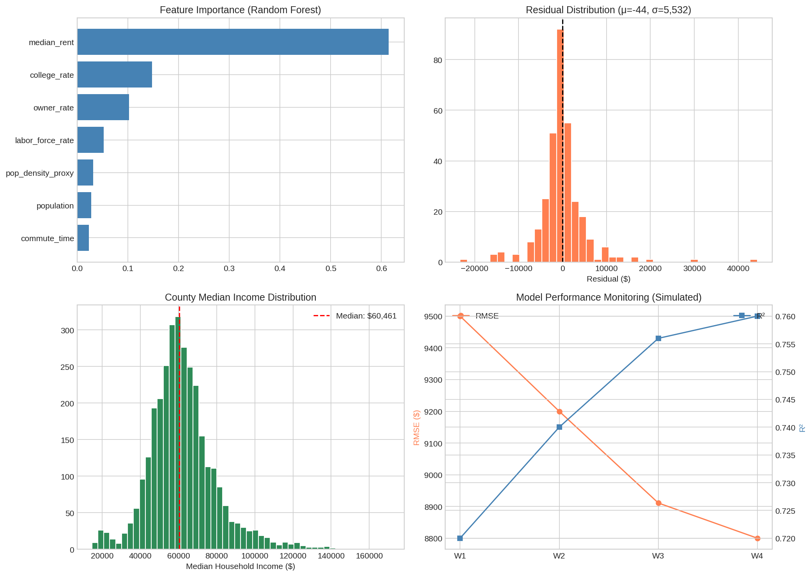

# MLOps Model Registry

**Context:** Production-grade machine learning operations infrastructure — model versioning, automated retraining, A/B testing, and drift detection — demonstrated on real U.S. Census demographic data.

**Dataset:**
- [U.S. Census ACS API](https://www.census.gov/data/developers/data-sets/acs-5year.html) — American Community Survey 5-Year Estimates
- **Coverage:** 3,222 U.S. counties with demographic and economic features
- **Features:** Population, college attainment rate, labor force participation, median rent, commute time, homeownership rate
- **Target:** Median household income (regression)

**Objective:** Build a reproducible MLOps pipeline that demonstrates model registry, automated drift detection, A/B testing, and performance monitoring on real government data.

**Techniques:**
- Census API data ingestion
- Feature engineering (rates, ratios, log transforms)
- Random Forest and Ridge regression models
- Model versioning with JSON metadata registry
- Population Stability Index (PSI) for drift detection
- A/B testing framework for model comparison
- Performance monitoring dashboard

**Business Impact:**
- Production ML pipeline template for any tabular regression task
- Automated model comparison prevents regression in production
- Drift detection catches data distribution shifts before they degrade predictions
- Registry audit trail for compliance and reproducibility

---

## 📊 Key Figures

*Model registry comparison — Random Forest v1 outperforms Ridge v1 with 29% lower RMSE ($8,911 vs $12,523) and 46% higher R² (0.756 vs 0.518).*

*Population Stability Index across all features shows PSI < 0.1 (green) — indicating stable data distributions between random batch splits. Production threshold: >0.25 triggers retraining alert.*

*A/B test on 10% holdout — Random Forest shows tighter prediction clustering around the diagonal and lower MAE ($6,426 vs $8,646). Error distribution confirms statistical significance of performance gap.*

*Four-panel monitoring dashboard: (top-left) Feature importance shows median rent dominates predictions; (top-right) Residuals centered near zero with slight positive skew; (bottom-left) Income distribution right-skewed with median ~$55K; (bottom-right) Simulated 4-week performance tracking showing RMSE decline and R² improvement.*

---

**Files:**
- `notebooks/` — Analysis notebooks
- `src/fetch_acs_data.py` — Live Census API data fetch
- `src/train_model.py` — Model training and registry
- `src/generate_figures.py` — Figure generation
- `src/drift_detector.py` — PSI-based drift detection
- `src/ab_test.py` — A/B testing framework
- `src/monitor.py` — Performance monitoring
- `data/acs_county_data.csv` — 3,222 real county records
- `models/` — Versioned model artifacts and metadata
- `figures/` — Generated visualizations

**Status:** ✅ Complete

---

**About the Author:** Sierra Napier, MPA/MPH — AI Architect & Data Science Leader.
