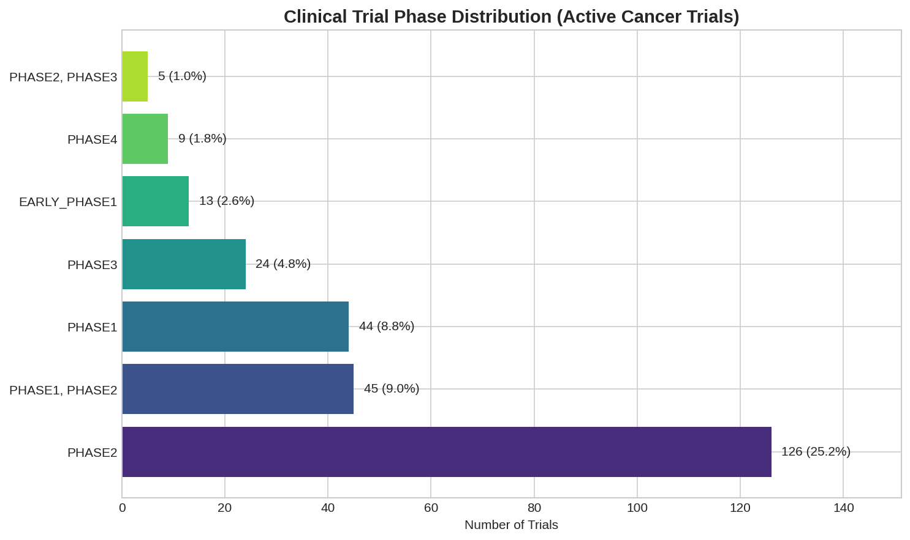
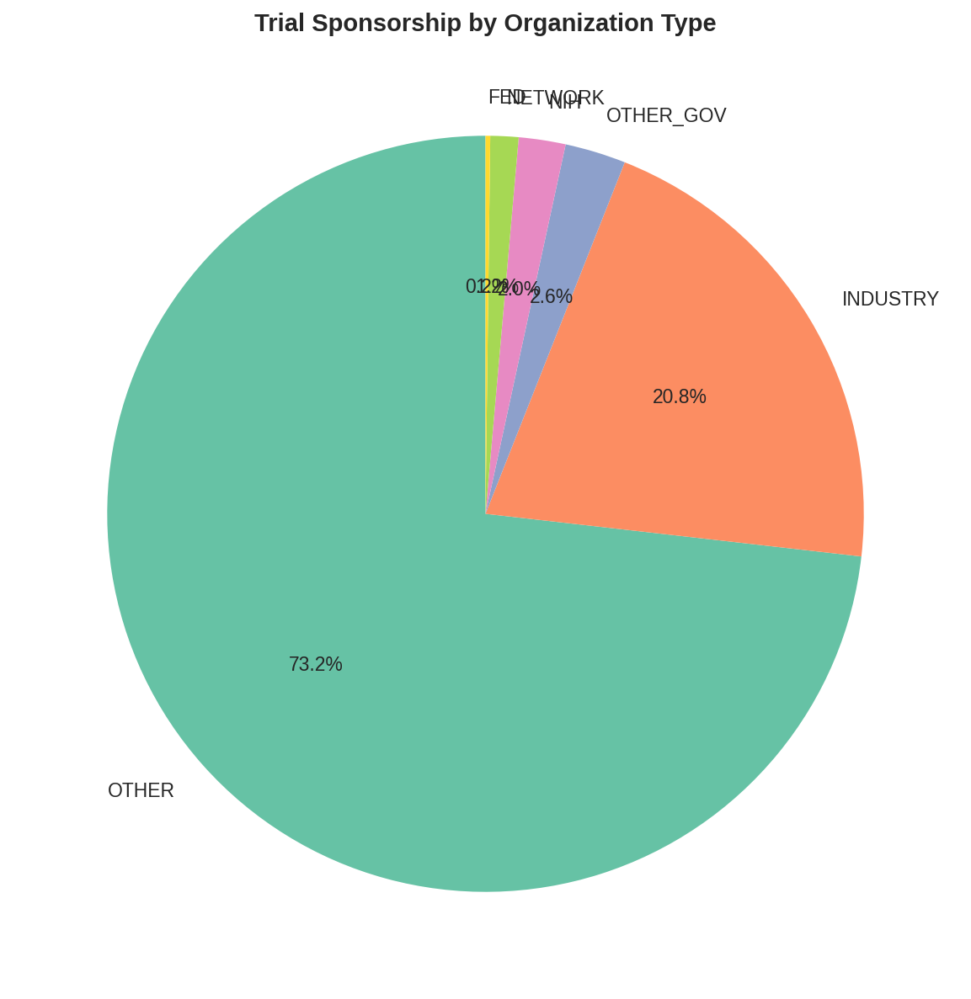
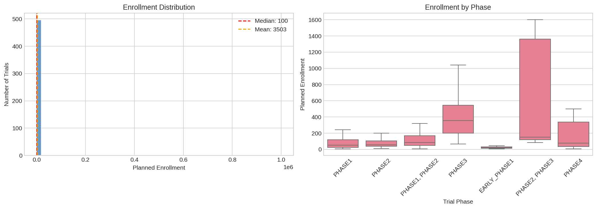
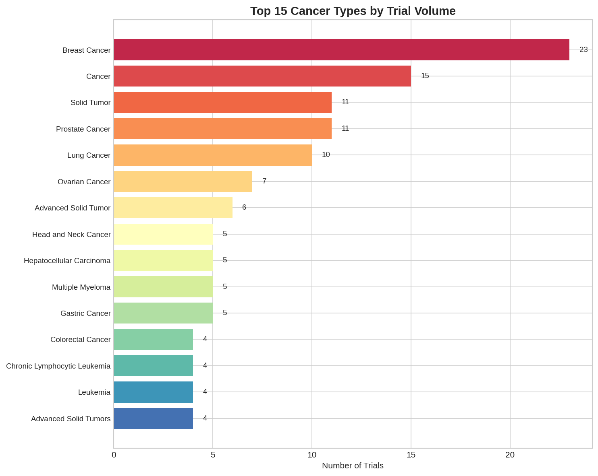
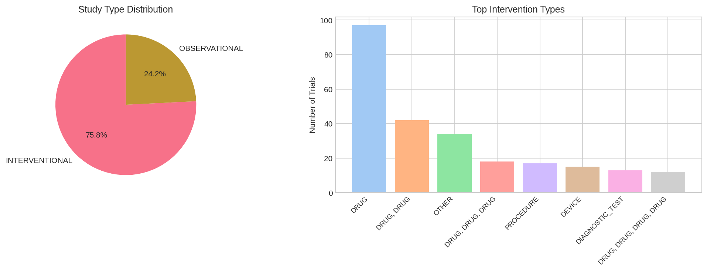
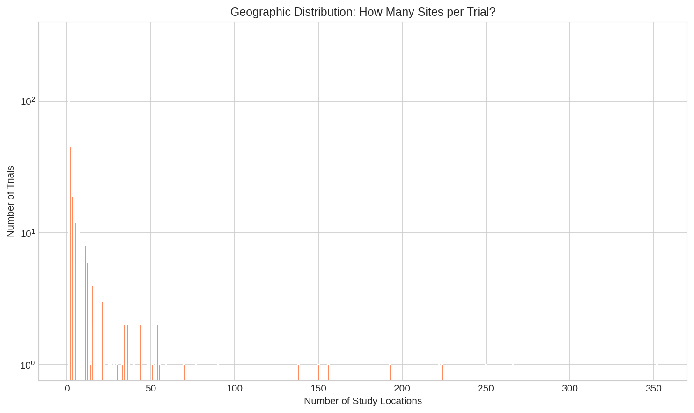

# Clinical Trial Landscape NLP

**Context:** Biomedical and pharmaceutical research trend analysis using ClinicalTrials.gov — the world's largest clinical trial registry maintained by the U.S. National Library of Medicine.

**Dataset:**
- [ClinicalTrials.gov API v2](https://clinicaltrials.gov/api/v2/studies) — free government API, no key required
- **Coverage:** 500 active cancer trials (fetched live), 500,000+ total registered trials
- **Fields:** NCT ID, title, condition, phase, sponsor, enrollment, locations, intervention type, study type, dates

**Objective:** Analyze the clinical trial landscape to identify research trends, sponsor behavior, enrollment patterns, and geographic distribution of oncology drug development.

**Techniques:**
- Clinical trial metadata extraction via REST API
- Phase and enrollment distribution analysis
- Sponsor classification (industry vs academic vs government)
- Condition frequency mining
- Geographic multi-site trend analysis

**Business Impact:**
- Pharma competitive intelligence — which sponsors dominate which cancer types
- Trial feasibility assessment — enrollment targets vs historical completion rates
- Site selection strategy — single-center vs multi-center trial patterns
- Portfolio gap analysis — which cancer indications are over/under-studied

---

## 📊 Key Figures

*Phase 2 dominates with 126 trials (25.2%) — the valley of death where most drugs fail, making this the critical filter for portfolio managers assessing probability of technical success.*

*Industry sponsors account for only 20.8% of active cancer trials — academic medical centers ("OTHER") drive the majority, suggesting a public-sector research backbone with selective commercial translation.*

*Median enrollment target is 100 patients, but the mean is 3,503 due to a long tail of mega-trials — the left histogram shows most trials are modest in scope while a few Phase 3 studies plan for 100,000+ subjects.*

*Breast cancer leads with 23 active trials, followed by lung and prostate — the "big three" of oncology trial volume that attract disproportionate funding and investigative attention.*

*75.8% interventional vs 24.2% observational — most trials are testing new therapies. Drug interventions dominate, followed by biological and device-based approaches.*

*60.4% of trials are single-site, but the multi-site tail extends to 352 locations — reflecting the bifurcation between academic single-center studies and global commercial registration trials.*

---

**Files:**
- `notebooks/` — Analysis notebooks
- `src/fetch_trials.py` — Live data fetch from ClinicalTrials.gov API
- `src/generate_figures.py` — Figure generation script
- `data/clinical_trials.csv` — 500 real trial records
- `figures/` — Generated visualizations

**Status:** ✅ Complete

---

**About the Author:** Sierra Napier, MPA/MPH — AI Architect & Data Science Leader.
