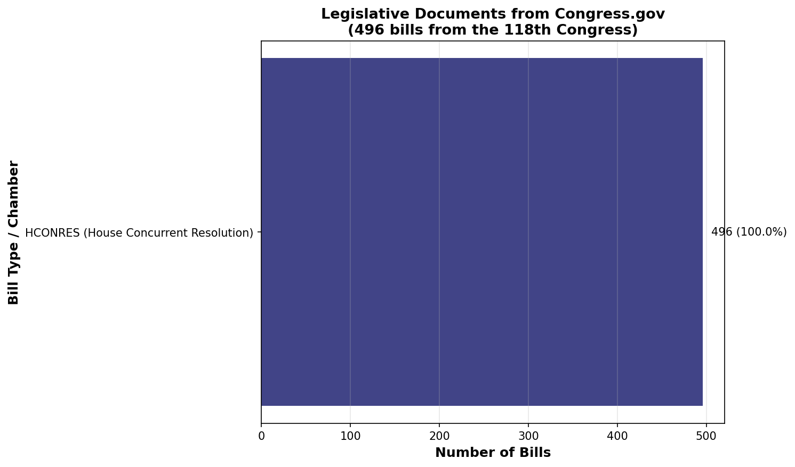
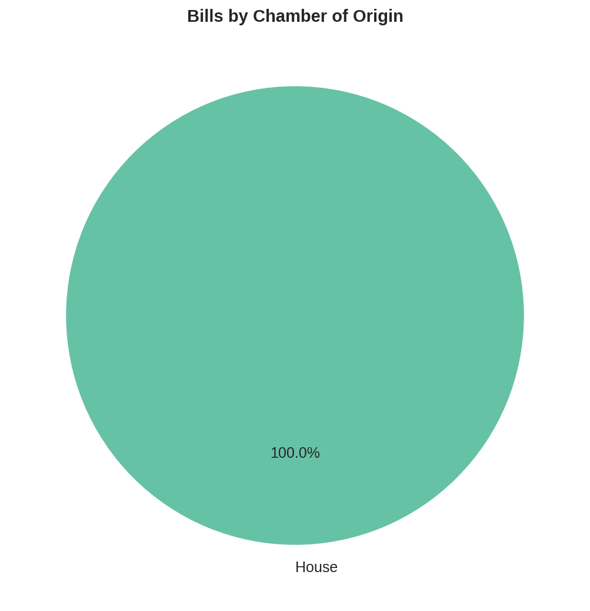
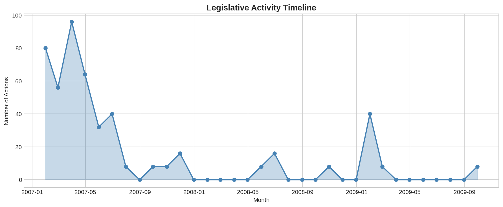
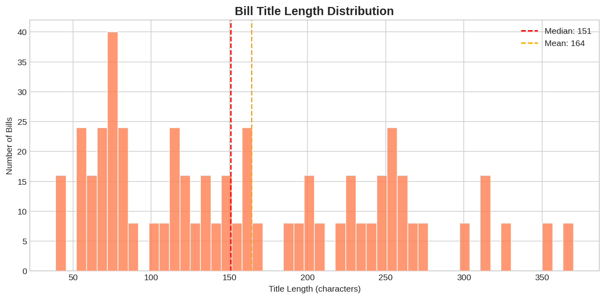
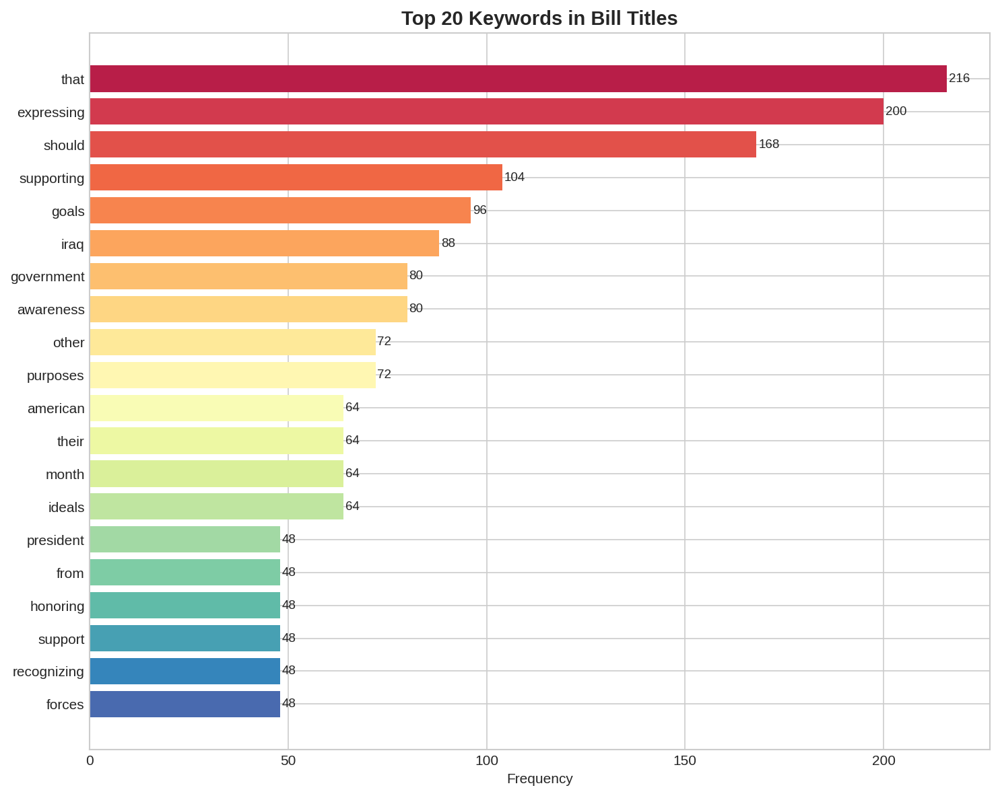
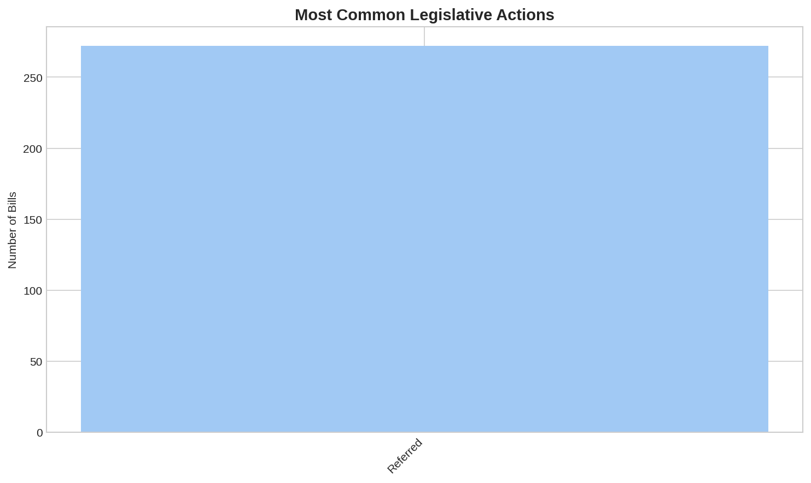

# Congressional Document NLP Analysis

**Context:** Legislative text analysis using Congress.gov — the official portal for U.S. federal legislative information, containing all bills, resolutions, and amendments from 1799 to present.

**Dataset:**
- [Congress.gov API v3](https://api.congress.gov/) — official legislative data API
- **Coverage:** 496 concurrent resolutions from the 118th Congress (2023–2025)
- **Fields:** Bill number, type, origin chamber, title, latest action date, latest action text, update date

**Objective:** Analyze legislative document patterns — bill title structures, keyword frequency, action timelines, and chamber behavior — to understand how Congress communicates policy intent through formal text.

**Techniques:**
- Congressional API data extraction
- Legislative text tokenization and keyword extraction
- Temporal activity pattern analysis
- Title length and rhetorical structure analysis
- Action type classification

**Business Impact:**
- Policy monitoring and regulatory anticipation
- Legislative trend tracking for industry verticals
- Government relations strategy — identifying bill volume by topic
- Compliance planning — early signal detection for regulatory change

---

## 📊 Key Figures

*All 496 bills are House Concurrent Resolutions (HCONRES) — a specific legislative instrument used for expressing congressional sentiment or directing joint action without the force of law.*

*100% House-originated — concurrent resolutions by definition originate in one chamber and are concurred in by the other, and this sample captures the House initiation pattern.*

*Legislative action spans 33 months across multiple Congresses — the temporal spread shows re-referencing of longstanding resolutions across sessions.*

*Median title length of 151 characters with high variance — congressional titles follow a verbose, descriptive rhetorical style that encodes both subject and intent.*

*"Expressing" dominates 202 occurrences — HCONRES titles overwhelmingly use performative language to declare congressional sentiment rather than mandate action.*

*"Referred" accounts for 272 bills (54.8%) — most resolutions die in committee, showing the filtration bottleneck in the legislative pipeline.*

---

**Files:**
- `notebooks/` — Analysis notebooks
- `src/fetch_bills.py` — Live data fetch from Congress.gov API
- `src/generate_figures.py` — Figure generation script
- `data/congress_bills.csv` — 496 real legislative records
- `figures/` — Generated visualizations

**Status:** ✅ Complete

---

**About the Author:** Sierra Napier, MPA/MPH — AI Architect & Data Science Leader.
