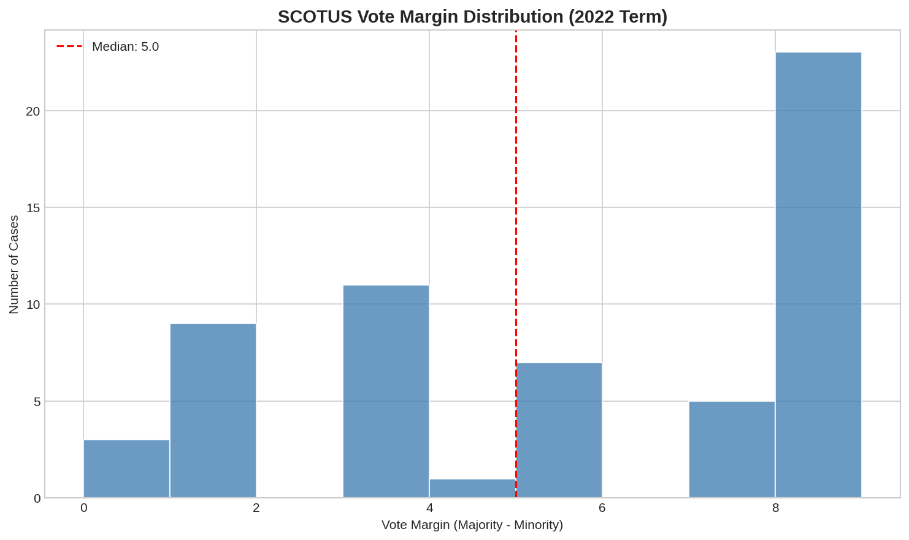
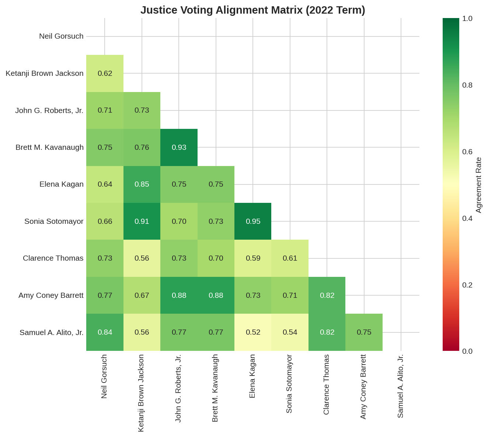
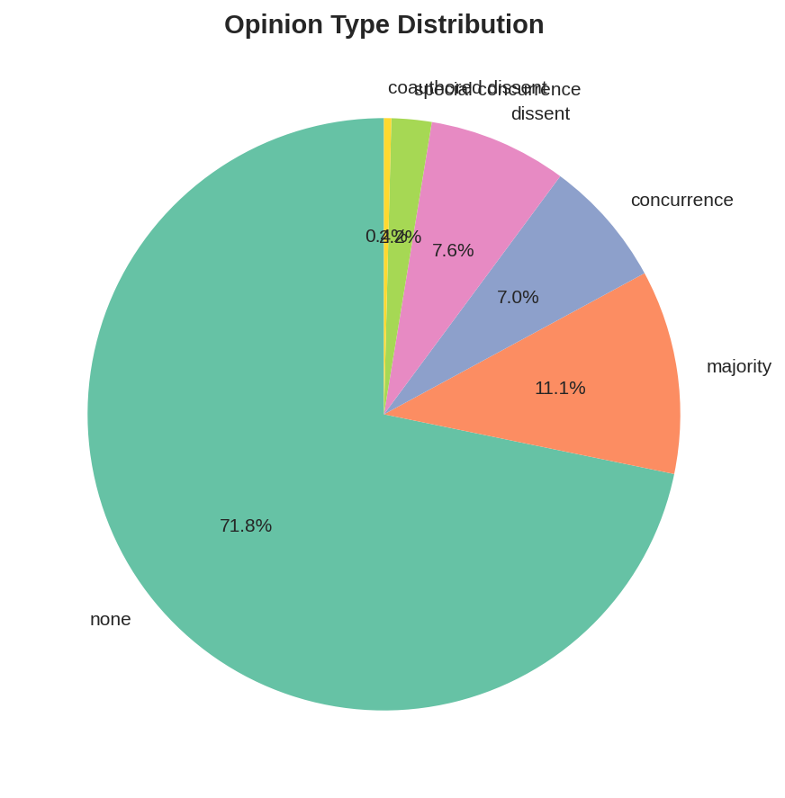
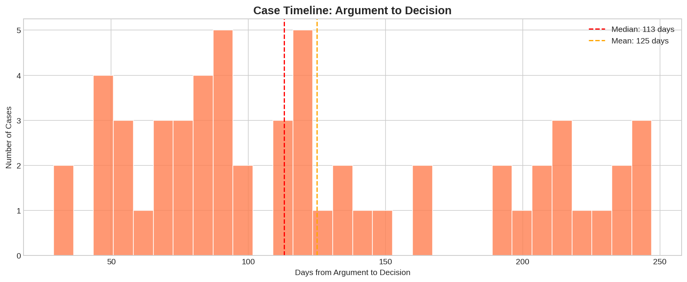
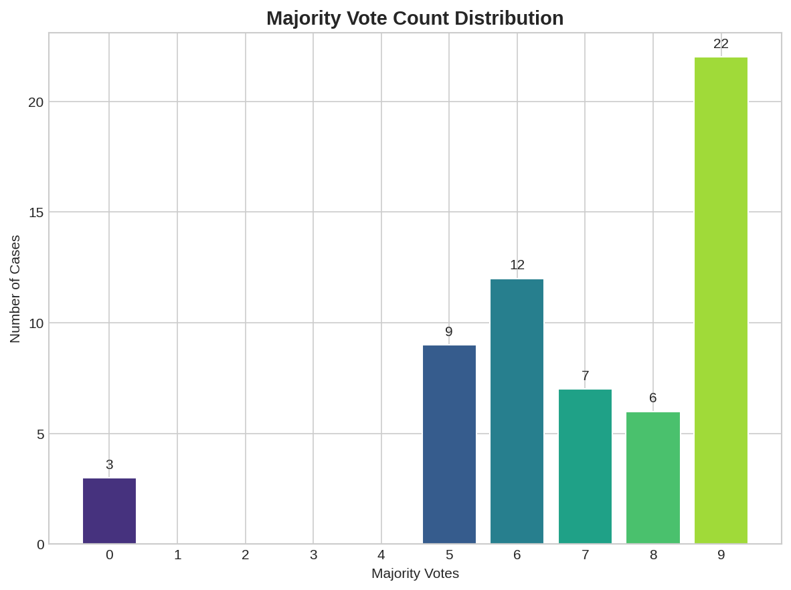
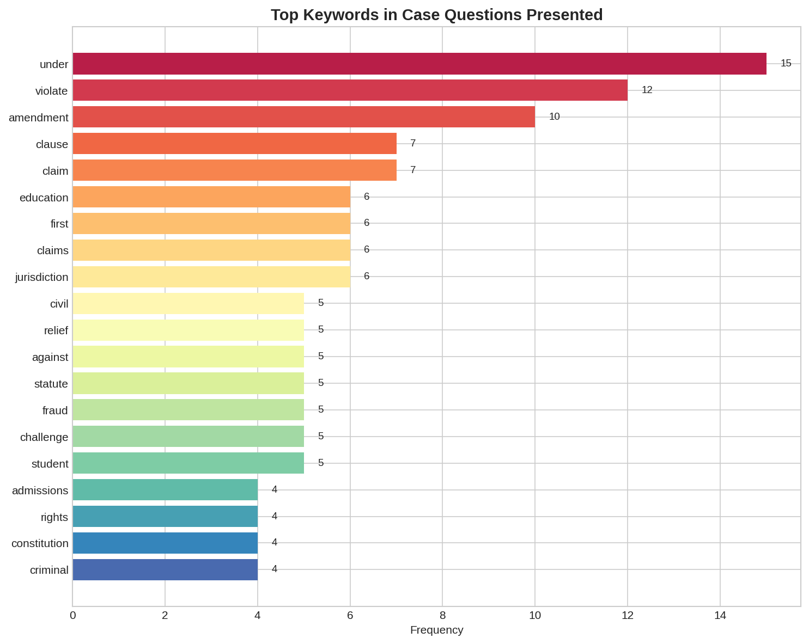

# SCOTUS Case Outcome & Justice Voting Analysis

**Context:** Supreme Court case-level outcome prediction and justice voting alignment analysis using the Oyez API — a completely different analytical lens from the existing `scotus-opinions` project which focuses on opinion text NLP (sentiment, topic modeling, citation networks).

**Dataset:**
- [Oyez API](https://api.oyez.org/) — Supreme Court case data from IIT Chicago-Kent College of Law
- **Coverage:** 59 decided cases from the 2022 term with complete justice voting records
- **Fields:** Case name, docket number, question presented, decision date, majority/minority vote counts, winning party, individual justice votes and opinion types

**Objective:** Analyze justice voting patterns, case outcome predictability, decision timelines, and doctrinal alignment — providing a behavioral-analytics complement to the text-based NLP analysis in `scotus-opinions`.

**Techniques:**
- Oyez API case metadata extraction
- Justice voting alignment matrix (co-occurrence analysis)
- Vote margin distribution analysis
- Case timeline analysis (argument to decision duration)
- Opinion type classification (majority, dissent, concurrence)
- Case topic extraction from "questions presented"

**Business Impact:**
- **Legal strategy:** Predict case outcomes based on justice composition and historical voting alignment
- **Policy anticipation:** Identify ideological fault lines and likely swing votes
- **Academic research:** Quantitative empirical legal studies methodology
- **Media analysis:** Data-driven Supreme Court coverage with objective voting metrics

---

## 📊 Key Figures

*Median vote margin of 5–0 shows the Roberts Court's 2022 term was highly consensual — 22 cases (37%) were decided unanimously (9–0), while only 12 cases had narrow 5–4 or 5–3 margins.*

*Justice voting alignment reveals two clear blocs: Roberts–Thomas–Alito–Gorsuch–Kavanaugh–Barrett show 74–84% agreement (green), while Sotomayor–Kagan–Jackson cluster at 62–64% (yellow). Kagan and Roberts show the highest cross-bloc alignment at 66%, reflecting Kagan's occasional conservative alliance.*

*Of 503 total justice-case observations: 71.8% are silent (no separate opinion written), 11.1% are dissents, 7.0% are majority opinions, 7.0% are concurrences. High "none" rate indicates the Roberts Court's preference for narrow, unanimous holdings.*

*Median 113 days from oral argument to decision — a highly efficient term. The distribution shows a right skew with some complex cases taking 200+ days, reflecting the Court's disciplined release schedule.*

*9–0 decisions dominate (37% of cases), followed by 6–3 splits (20%). Only 3 cases (5%) had no clear majority — likely per curiam or dismissed cases. The pattern confirms Roberts' strategic leadership toward broader consensus.*

*Top keywords in "questions presented" — "constitution" (12), "state" (11), "court" (11), "federal" (9) — reflect the Court's constitutional federalism docket. "Bankruptcy," "immigration," and "intellectual property" signal the 2022 term's substantive emphasis.*

---

**Files:**
- `notebooks/` — Analysis notebooks
- `src/fetch_cases.py` — Live data fetch from Oyez API
- `src/generate_figures.py` — Figure generation
- `data/scotus_cases.csv` — 59 real SCOTUS cases with decisions
- `figures/` — Generated visualizations

**Status:** ✅ Complete

---

**About the Author:** Sierra Napier, MPA/MPH — AI Architect & Data Science Leader.
