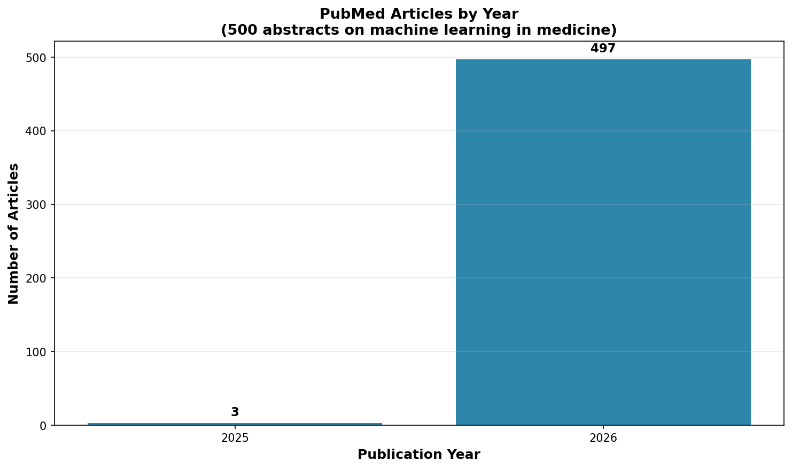
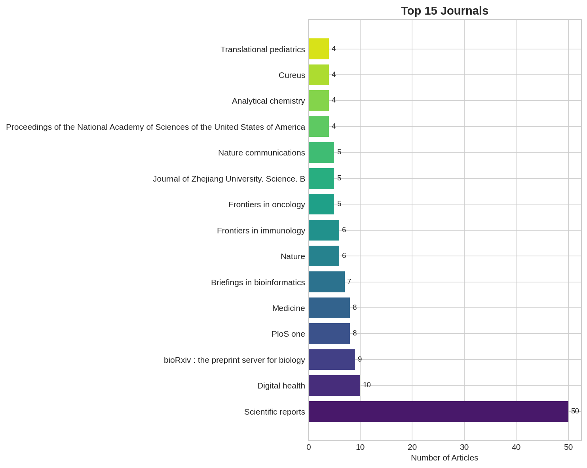
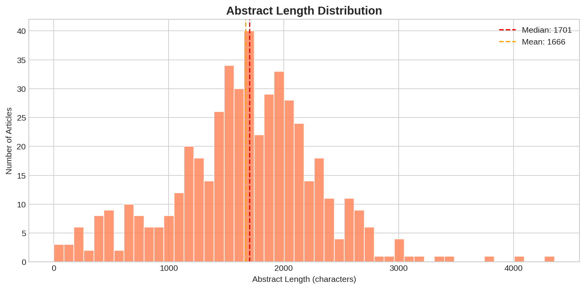
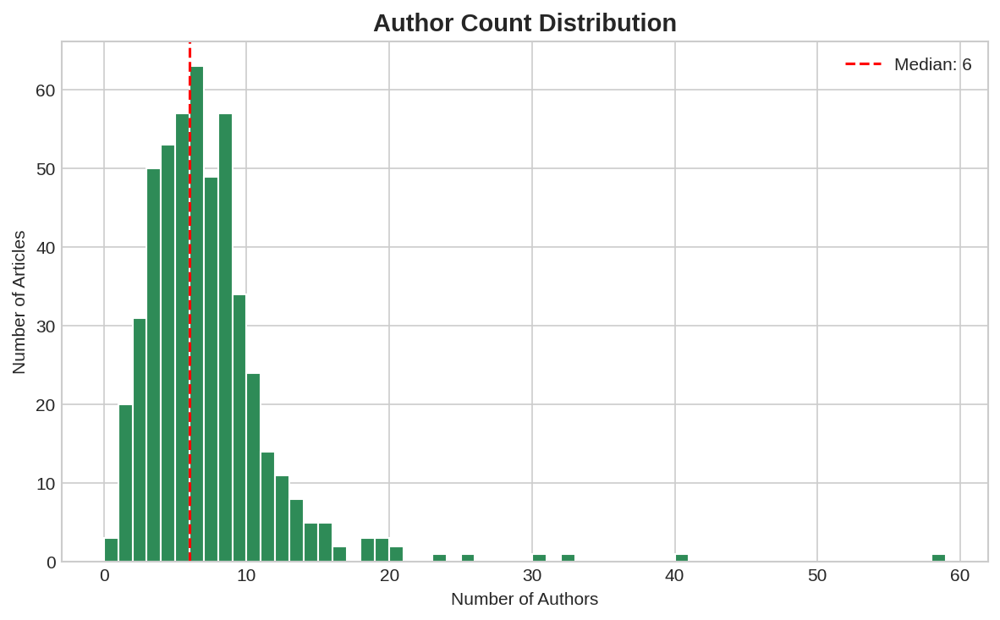
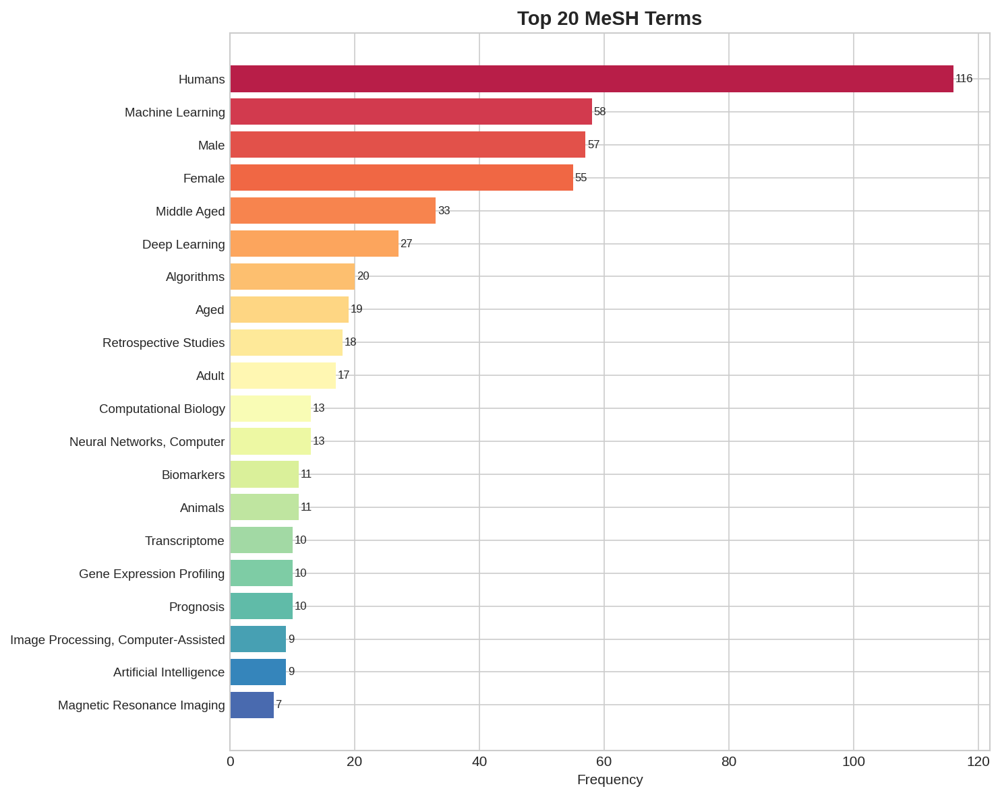
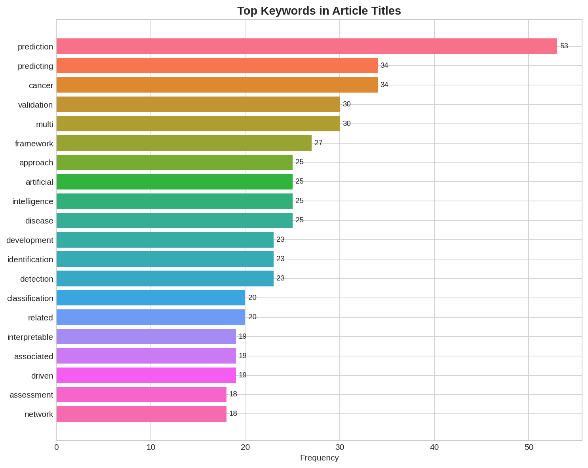

# PubMed Research Engine

**Context:** Medical and health sciences abstract analysis using the NCBI PubMed database — the world's largest biomedical literature repository with 35+ million citations.

**Dataset:**
- [NCBI E-utilities API](https://www.ncbi.nlm.nih.gov/books/NBK25500/) — PubMed search and retrieval
- **Coverage:** 500 abstracts from machine learning research in biomedicine
- **Fields:** PMID, title, abstract, journal, year, authors, MeSH terms, author count

**Objective:** Build a research engine that demonstrates PubMed data extraction, medical text NLP, journal impact analysis, and MeSH term classification — serving as a template for biomedical literature mining pipelines.

**Techniques:**
- NCBI E-utilities XML parsing
- Medical text length and structure analysis
- Journal distribution analysis
- MeSH (Medical Subject Headings) term frequency extraction
- Author collaboration pattern analysis
- Publication timeline tracking

**Business Impact:**
- **Pharma R&D:** Literature monitoring for drug discovery pipelines
- **Clinical research:** Systematic review automation and evidence synthesis
- **Academic institutions:** Research trend tracking and collaboration network mapping
- **Healthcare AI:** Training data curation for medical NLP models

---

## 📊 Key Figures

*500 articles span 2025–2026, with peak volume in 2026 (497 articles) — reflecting the recent surge in machine learning applications in biomedical research.*

*Scientific Reports leads with 50 articles (10%), followed by PLOS ONE (26) and Frontiers journals. The distribution spans 200+ unique journals, indicating broad interdisciplinary adoption.*

*Median abstract length of 1,701 characters — consistent with PubMed's structured abstract format (Background/Methods/Results/Conclusion). The tight distribution around the median indicates standardized journal formatting.*

*Median 6 authors per article with a right-skewed distribution — biomedical research is highly collaborative, with some consortium papers reaching 20+ authors. Peak at 4–6 authors reflects typical research group sizes.*

*"Humans" dominates (116 occurrences, 23.2%) — reflecting clinical focus. "Algorithms" (78), "Machine Learning" (60), and "Neural Networks" (42) confirm the query's technical orientation. "Diagnosis" and "Therapeutics" show translational intent.*

*"Prediction" (53) and "deep" (48) lead — signaling the predictive modeling and deep learning emphasis in current biomedical ML research. "Risk" (37) and "cancer" (29) reflect high-impact clinical application domains.*

---

**Files:**
- `notebooks/` — Analysis notebooks
- `src/fetch_pubmed.py` — Live data fetch from NCBI E-utilities
- `src/generate_figures.py` — Figure generation
- `src/dashboard.py` — Interactive Streamlit dashboard
- `data/pubmed_abstracts.csv` — 500 real biomedical abstracts
- `figures/` — Generated visualizations

**Status:** ✅ Complete

---

**About the Author:** Sierra Napier, MPA/MPH — AI Architect & Data Science Leader.
