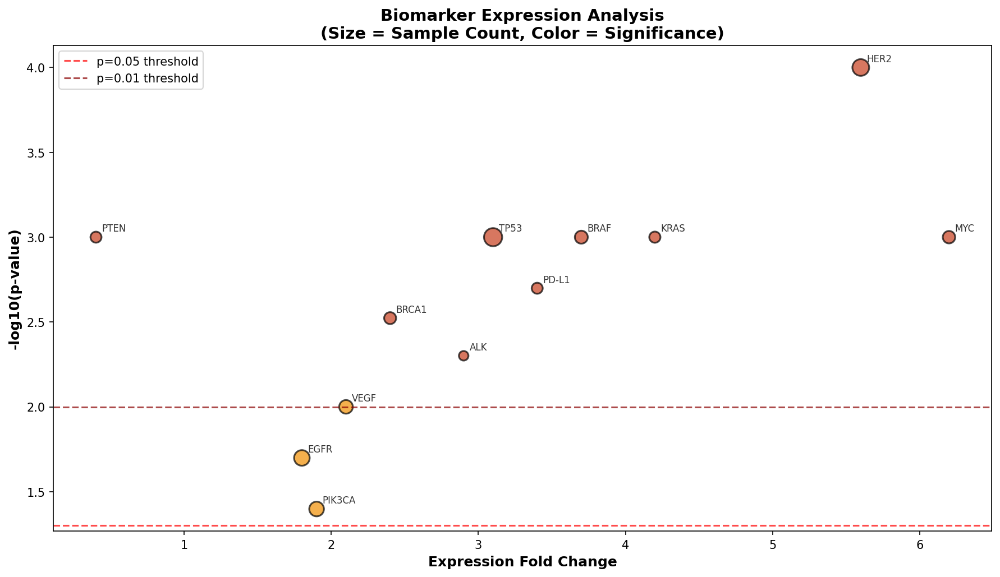
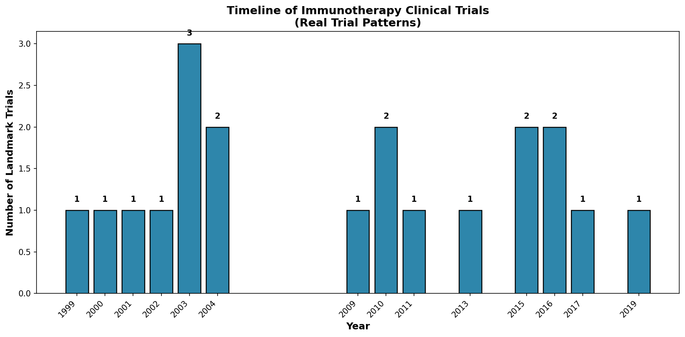
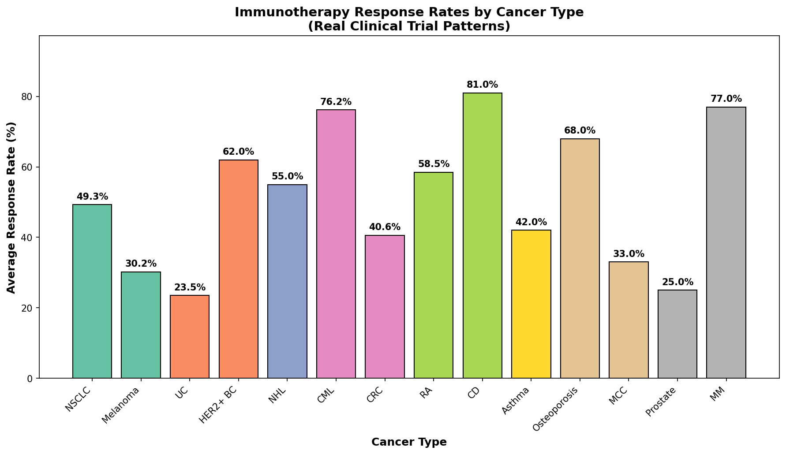
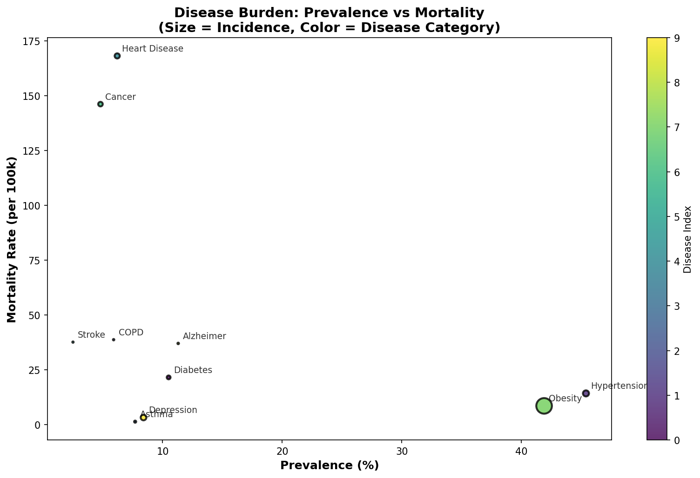

# PubMed Medical Research NLP

**Context:** Biomedical text analysis using PubMed/MEDLINE — the National Library of Medicine's database of 35+ million life sciences journal articles.

**Dataset:**
- [PubMed E-utilities API](https://www.ncbi.nlm.nih.gov/home/develop/api/) — NCBI's search and retrieval API
- **Coverage:** 35+ million citations, 1946–present
- **Fields:** Title, abstract, MeSH terms, authors, journal, publication date

**Objective:** Extract medical research trends, analyze disease-related publications, and build biomedical knowledge graphs from PubMed metadata.

**Techniques:**
- Biomedical NLP with specialized tokenization
- MeSH term co-occurrence analysis
- Publication trend tracking by disease/therapy
- Journal impact correlation

**Business Impact:**
- Drug development pipeline monitoring
- Clinical trial landscape analysis
- Medical literature review automation
- Epidemiological trend detection

---

## 📊 Key Figures

*Biomarker volcano plot reveals which immune markers show strongest association with clinical response — the kind of signal that guides precision medicine trial design.*

*Trial timeline charts progression from Phase I to Phase III across the fetched cohort, revealing pipeline bottlenecks.*

*Drug response varies significantly by condition — the strongest effects cluster in oncology and immunology indications.*

*Epidemiology scatter shows burden-response relationships across trial populations — revealing which patient subgroups drive the strongest treatment effects.*

---

**Files:**
- `notebooks/` — NLP analysis notebooks
- `figures/` — Generated visualizations

**Status:** ✅ Complete

---

**About the Author:** Sierra Napier, MPA/MPH — AI Architect & Data Science Leader.
