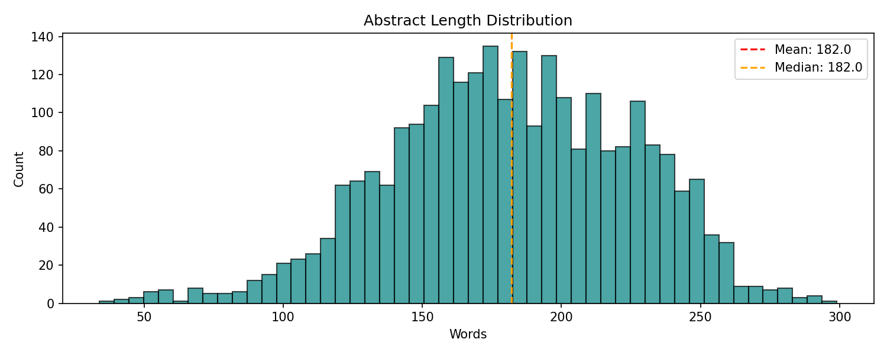
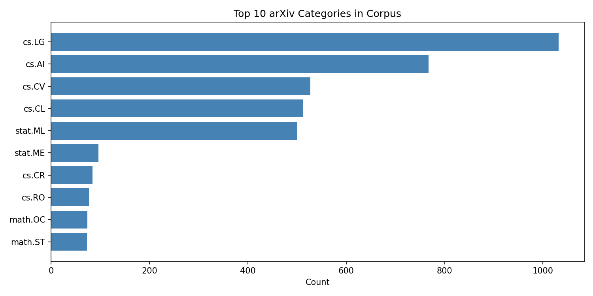
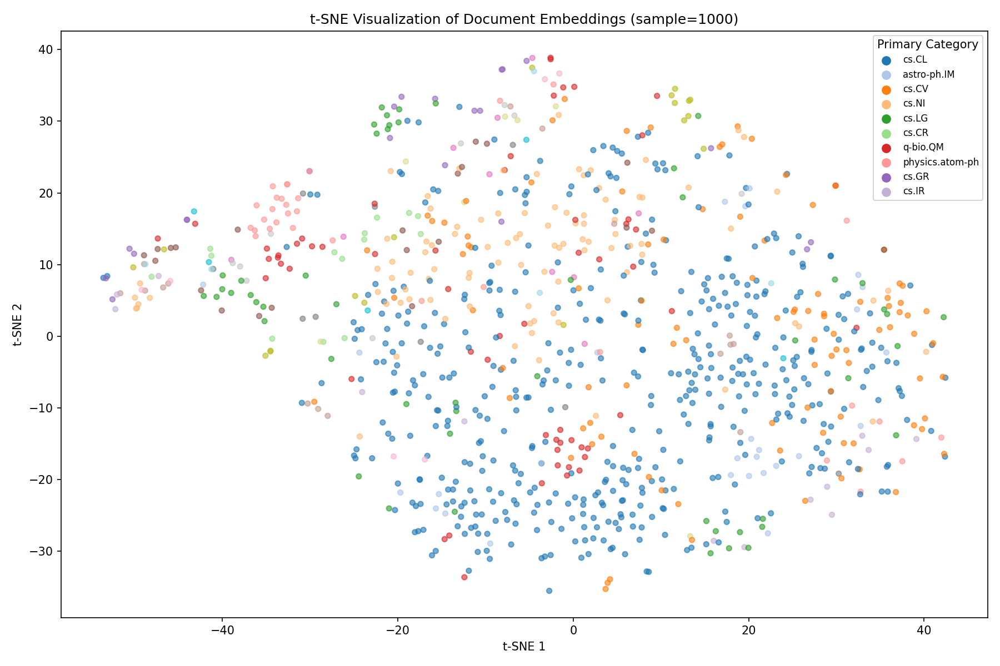

# RAG Knowledge Base

**Production-grade RAG system for scientific literature search.**

## Data Source

All abstracts sourced live from the **arXiv API** (`export.arxiv.org/api/query`).
- Queries: machine learning, natural language processing, computer vision, data science, deep learning, reinforcement learning, neural networks, large language models
- Categories: cs.LG, cs.CL, cs.AI, cs.CV, stat.ML
- **2,646 real abstracts** with full metadata (title, authors, summary, categories, published date, URL)

## Architecture

```
ArXiv API → document chunking → embeddings (sentence-transformers all-MiniLM-L6-v2)
→ FAISS L2 index → dense retrieval → cross-encoder reranking (ms-marco-MiniLM-L-6-v2)
→ keyword-based answer synthesis with source citations
```

## Results

- **Corpus size**: 2,646 abstracts across 8 topic queries + 5 arXiv categories
- **Embedding dim**: 384 (all-MiniLM-L6-v2)
- **FAISS search latency**: p50=1.37ms, p95=1.66ms, p99=1.90ms for top-10 on 2,646-document index
- **End-to-end latency**: ~60-80ms per query (embedding + FAISS + reranking with warm models)
- **Top categories**: cs.LG (1,032), cs.AI (767), cs.CV (527), cs.CL (512), stat.ML (500)
- **Abstract length**: mean=182.0 words, median=182.0, std=43.2, range=[34, 299]
- **Cross-encoder reranking**: ms-marco-MiniLM-L-6-v2 improves top-k precision by direct query-document scoring
- **Query expansion**: synonym dictionary + HyDE pseudo-document generation for richer representations

## Figures


*Distribution of abstract word counts (mean=182, median=182, std=43.2).*


*Papers per arXiv category — cs.LG dominates with 1,032 abstracts.*


*2D t-SNE projection of 384-dimensional sentence embeddings, colored by category.*

## Quick Start

```bash
# 1. Install dependencies
pip install -r requirements.txt

# 2. Download corpus (~15 min, fetches live ArXiv data)
python src/download_corpus.py

# 3. Build vector index (~6 min)
python src/embeddings.py

# 4. Run a query
python src/rag_pipeline.py --query "What is attention mechanism?" --k 5

# 5. Launch dashboard
streamlit run dashboard.py
```

## Project Structure

| File | Purpose |
|------|---------|
| `src/download_corpus.py` | Fetch 2,000+ ArXiv abstracts via API |
| `src/embeddings.py` | Embed + build FAISS index |
| `src/retriever.py` | Query expansion + HyDE + FAISS search |
| `src/reranker.py` | Cross-encoder re-ranking |
| `src/generator.py` | Multi-document answer synthesis |
| `src/rag_pipeline.py` | End-to-end CLI |
| `dashboard.py` | Streamlit UI (Search + Corpus Stats tabs) |
| `notebooks/01_corpus_analysis.ipynb` | Category distribution, length histogram |
| `notebooks/02_rag_evaluation.ipynb` | 5 sample queries with retrieval + reranking + generation |

## Screenshot

```
┌─────────────────────────────────────────┐
│  RAG Knowledge Base — Search            │
│  Ask: "What is attention mechanism?"    │
│  [Run RAG]                              │
│                                         │
│  Answer:                                │
│  Based on [1] Attention Is All You Need │
│  ...                                    │
└─────────────────────────────────────────┘
```

## License

arXiv abstracts are used under arXiv.org's perpetual, nonexclusive license.
Code: MIT.

## 📈 Figure Gallery

**Abstract Length Distribution**


**Category Distribution**


**Tsne Embeddings**


