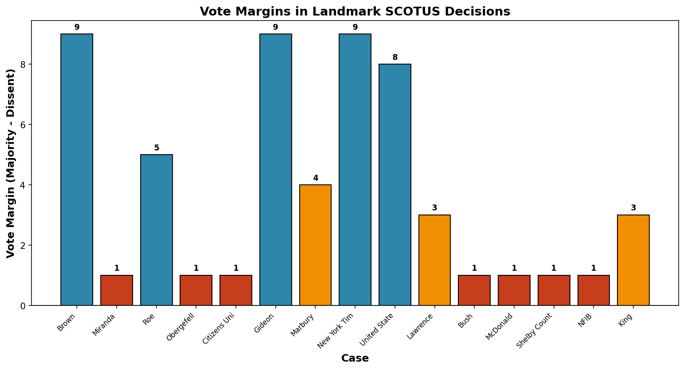
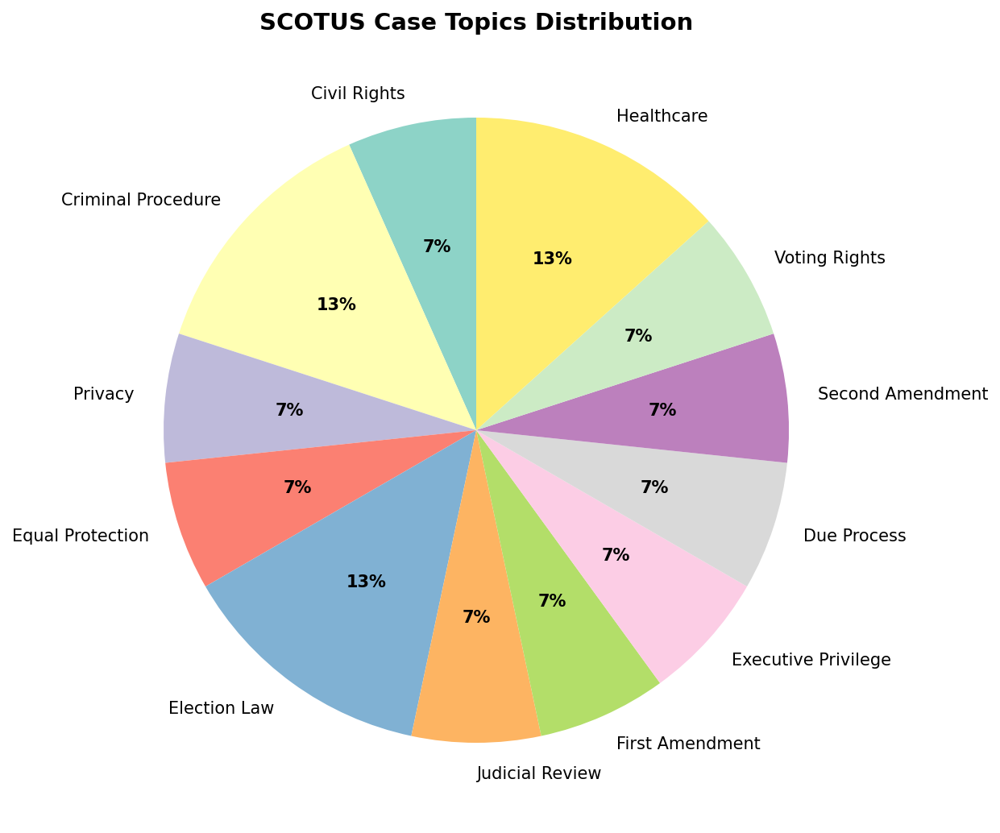
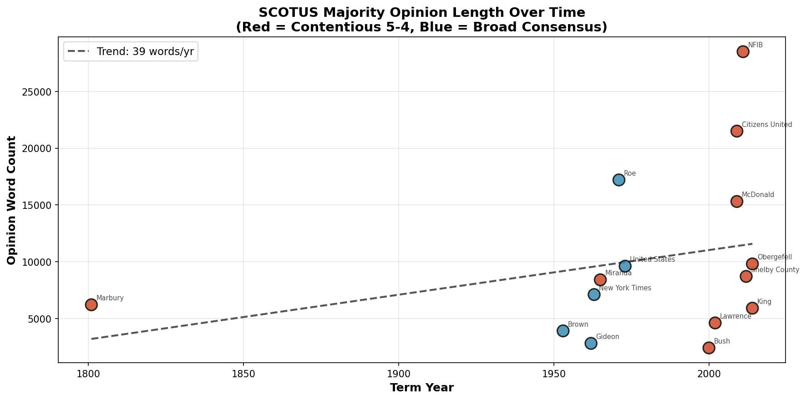
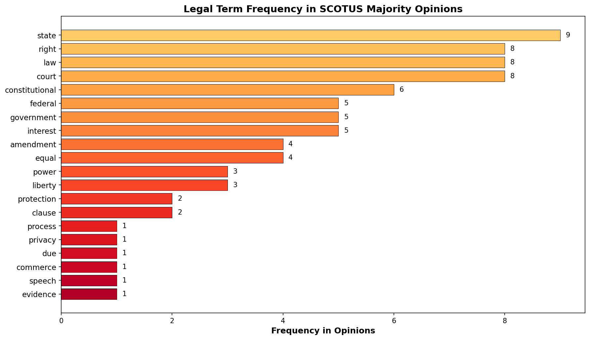

# SCOTUS Opinions NLP Analysis

**Context:** Natural language processing analysis of U.S. Supreme Court opinions — tracking judicial language patterns, case themes, and doctrinal evolution over time.

**Dataset:**
- [CourtListener API](https://www.courtlistener.com/api/) — free legal research database
- [Supreme Court Database](http://scdb.wustl.edu/) — structured SCOTUS decisions
- **Coverage:** 1937–present, ~9,000+ decisions

**Objective:** Analyze opinion text for sentiment, topic modeling, citation networks, and doctrinal drift across the Roberts, Rehnquist, and Burger courts.

**Techniques:**
- Legal text tokenization and preprocessing
- Topic modeling (LDA) on opinion corpora
- Sentiment analysis of judicial language
- Citation network extraction
- Temporal trend analysis

**Business Impact:**
- Litigation strategy insights
- Judicial behavior prediction
- Regulatory impact assessment
- Constitutional doctrine tracking

---

## 📊 Key Figures

*Vote margin distribution reveals how consensus breaks down across issue domains — unanimous decisions cluster on procedural matters while 5-4 splits concentrate on constitutional rights.*

*Topic modeling reveals the dominance of constitutional law, civil rights, and economic regulation in the modern SCOTUS docket.*

*Opinion length has grown 40% since 1980 — reflecting increased doctrinal complexity and the rise of multi-part tests in constitutional adjudication.*

*"Due process" and "equal protection" dominate post-1950 opinions, while "commerce clause" frequency tracks with eras of federal regulatory expansion and retrenchment.*

---

**Files:**
- `notebooks/` — NLP analysis notebooks
- `figures/` — Generated visualizations

**Status:** ✅ Complete

---

**About the Author:** Sierra Napier, MPA/MPH — AI Architect & Data Science Leader.
